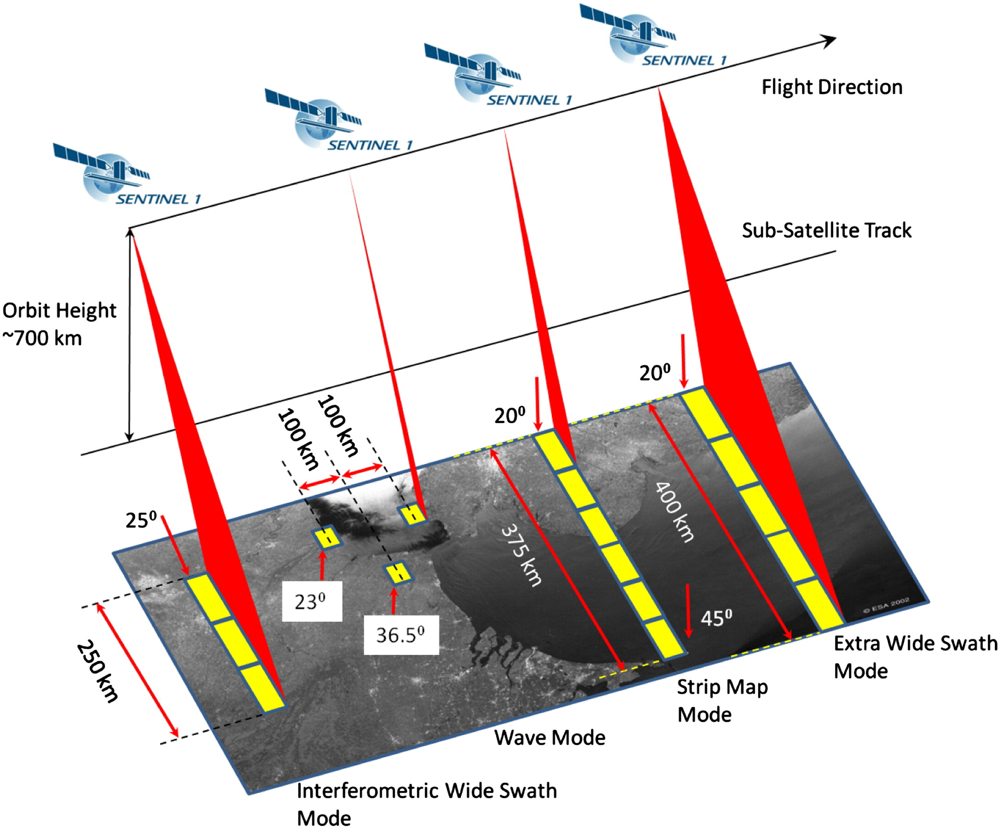
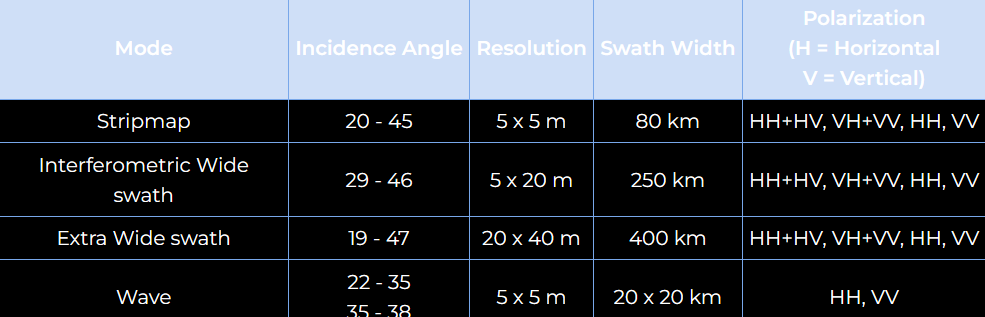
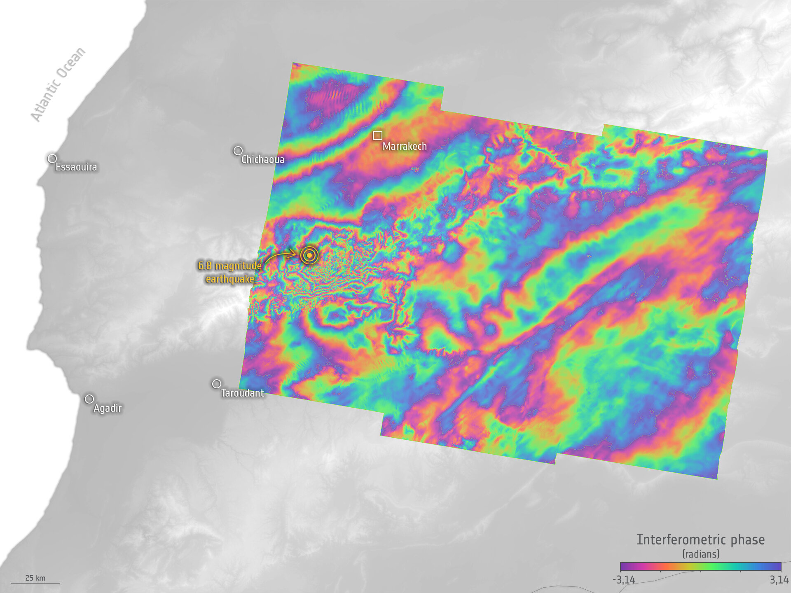
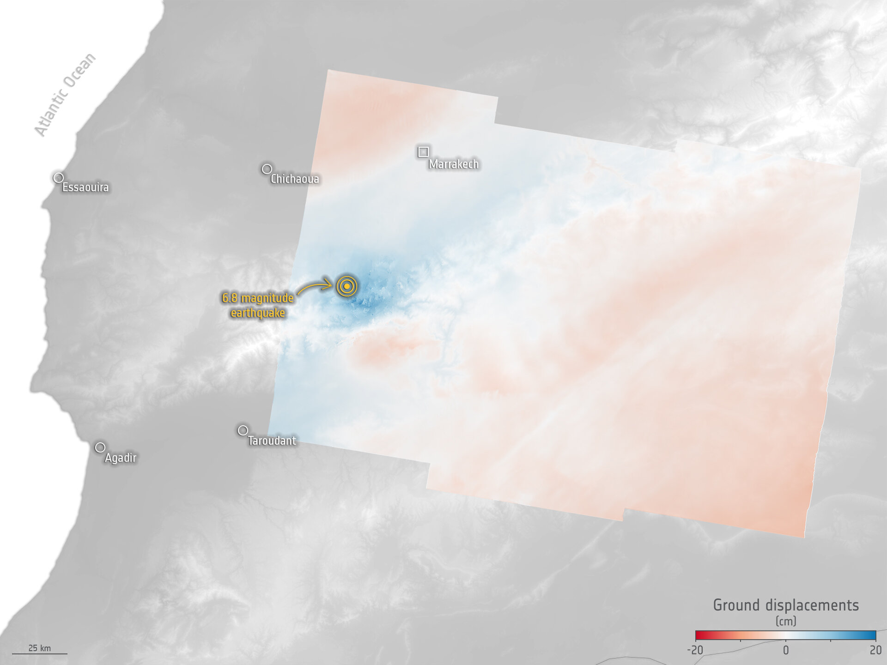

#Summary

##concept

.pull-left[
* Sentinel-1 consists of **2** satellites
 * Sentinel-1A
 * Sentinel-1B
* sharing the same orbital plane

* provide high-resolution imagery under all weather conditions, both day and night
* Sentinel-1 satellites orbit 180° apart and enable the **entire Earth** to be imaged every **6** days
]

```{r echo=FALSE, out.width = "50%", fig.align='right', cache=FALSE, fig.cap="(Source: ESA)"}

knitr::include_graphics('image/1.jpg')

```
---
##SAR 
The SENTINEL-1 mission features a C-band Synthetic Aperture Radar (C-SAR) with notable capabilities:
- **Dual Polarization**: Useful for analyzing land cover and monitoring sea ice.
- **High Data Capacity**: Comes with 1,410 Gb storage and fast data transmission at 520 Mbit/s.
- **Versatile Imaging Modes**: Offers four modes for different needs - Strip Map (SM) for detailed imaging, Interferometric Wide Swath (IW) and Extra Wide Swath (EW) for broad area coverage, and Wave Mode (WV) for ocean wave patterns.
```{r echo=FALSE, out.width = "45%", fig.align='center', cache=FALSE, fig.cap="(Source: ESA)"}

```

---
##Resolution and Swath
* Spatial resolutions depend on the acquisition mode and the level of  processing.
 * Level-1 SLC
 * Level-1 GRD
 * Level-2 OCN
```{r echo=FALSE, out.width = "100%", fig.align='center', cache=FALSE, fig.cap="(Source: ESA)"}

```
---
#Application
1. **Environmental Monitoring**: Assessing changes in land use, monitoring forest cover and deforestation, tracking desertification, and observing wetland dynamics.
2. **Disaster Management**: Providing crucial data for the assessment and monitoring of natural disasters like floods, earthquakes, landslides, and volcanic eruptions, aiding in emergency response and recovery efforts.
3. **Agriculture**: Supporting precision agriculture practices by monitoring crop health, estimating yields, and managing water resources more effectively.
4. **Climate Change Research**: Contributing to climate models with data on ice sheet movements, sea-level rise, and the atmosphere's composition.
5. **Oceanography**: Monitoring ocean currents, sea ice extent, and marine pollution, including oil spill detection and ship monitoring for maritime security.
6. **Urban Planning**: Assisting in urban expansion planning, infrastructure development, and the monitoring of urban heat islands.
7. **Water and Soil Management**: Observing water bodies for quality assessment, tracking soil moisture levels, and managing irrigation systems.
8. **Humanitarian Aid**: Supporting humanitarian relief efforts by providing updated maps and terrain information in crisis situations, helping in the planning and coordination of aid.

---
##Sentinel-1 Shows Morocco Earthquake Changes
Following the devastating 6.8 magnitude earthquake in Morocco on 08/09/2023, Copernicus Sentinel-1 satellite data is aiding **emergency responses** and scientific research by analyzing ground shifts.
.pull-left[
The maps can be used by rescuers to decide on **the best course of action**, by identifying which roads to take and which bridges to avoid in case of collapse, for example.
```{r echo=FALSE, out.width = "60%", fig.align='center', cache=FALSE, fig.cap="(Source: ESA)"}

```
]
.pull-right[
Sentinel-1's radar images track **subtle and significant Earth surface changes**(more pronounced than gradual subsidence or uplift), enabling precise analysis of earthquake impacts.
```{r echo=FALSE, out.width = "60%", fig.align='center', cache=FALSE, fig.cap="(Source: ESA)"}

```
]
---
#Reflection
* The unique advantage of the Sentinel-1 satellite mission lies in its utilization of **Synthetic Aperture Radar (SAR)** technology. 
 * As an **active sensor**, SAR operates independently of sunlight, ensuring the collection of reliable data under any weather conditions.
  * This **capability allows** Sentinel-1 to observe the Earth's surface through cloud cover, at night, or in other low-light conditions. 
* Furthermore, the Sentinel-1 mission consists of two satellites, Sentinel-1A and Sentinel-1B, which follow nearly identical orbits but are separated by 180 degrees. 
 * This configuration offers **high temporal resolution**, enabling the mission to provide frequent revisits to specific areas. 
* These features together enhance the value of Sentinel-1 in the field of Earth observation, particularly in applications such as environmental monitoring, disaster management, and climate change research.
---
##References
“SAR Basic Theory and Practical Exercises with SNAP (English Version).” Sentinel Online, sentinel.esa.int/web/sentinel/missions/sentinel-1/sar-basic-theory-and-practical-exercises-with-snap-english. Accessed 21 Mar. 2024.

“Sentinel-1 - Instrument Payload - Sentinel Online - Sentinel.” Sentinel.esa.int, sentinel.esa.int/web/sentinel/missions/sentinel-1/instrument-payload.

“Sentinel-1 - Mission Objectives - Sentinel Online.” Esa.int, 2020, sentinel.esa.int/web/sentinel/missions/sentinel-1/mission-objectives.

“Sentinel-1 - Overview - Sentinel Online.” Esa.int, 2020, sentinel.esa.int/web/sentinel/missions/sentinel-1/overview.

“Sentinel-1 Reveals Shifts from Morocco Earthquake.” Www.esa.int, www.esa.int/Applications/Observing_the_Earth/Copernicus/Sentinel-1/Sentinel-1_reveals_shifts_from_Morocco_earthquake.
